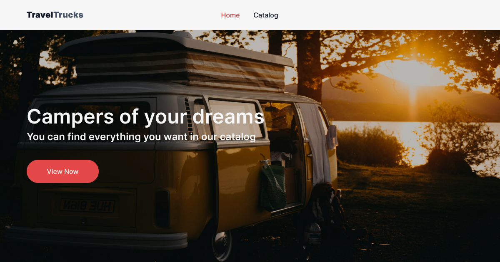

<h1 align="center">TravelTrucks</h1>

<p align="center">
  
</p>

<p>
  A web-based campervan rental app offers significant value to users looking for a convenient and efficient way to plan their trips.
</p>

<br/>

<h3>🌟 Features</h3>

<h6>Intuitive catalog:</h6>
<p>
  Users can easily browse through a variety of campers using filters by location, type, and equipment, allowing them to quickly find the perfect fit.
</p>

<h6>Personalization:</h6>
<p>
  The ability to add campers to a favorite list helps users save and organize the options they are most interested in for easy access in the future.
</p>

<h6>Detailed information:</h6>
<p>
  Detailed campervan descriptions with photos and specifications allow users to dive deeper into the details to make an informed decision.
</p>

<h6>Ease of booking:</h6>
<p>
  With the ability to send booking requests directly through the app, the booking process becomes quick and hassle-free.
</p>

<h6>Convenience and time saving:</h6>
<p>
  Everything from searching to booking can be done in one place, which saves users time and effort.
</p>

<p>
  These features make the web app not only a useful tool for travel planning, but also provide a pleasant user experience, encouraging customer return.
</p>

<br/>

<h3>🚀 Getting Started</h3>

<p>To run the project locally, follow these steps:</p>

```bash
# 1. Clone the repository
git clone https://github.com/bonny-art/travel-trucks.git

# 2. Navigate to the project folder
cd travel-trucks

# 3. Install dependencies
npm install

# 4. Run the development server
npm run dev
```

<p>Open your browser and navigate to <a href="http://localhost:5173" target="_blank">http://localhost:5173</a></p>

<br/>

<h3>🧰 Tools and technologies</h3>

<div align="center">
  <code></code>
  <code></code>
  <code></code>
  <code></code>
  <code></code>
  <code></code>
  <code></code>
  <code></code>
  <code></code>
  <code></code>
</div>

<br/>

<h3>📫 Feedback</h3>

<p>If you have suggestions or encounter issues, feel free to open an issue or submit a pull request. Contributions are always welcome!</p>
